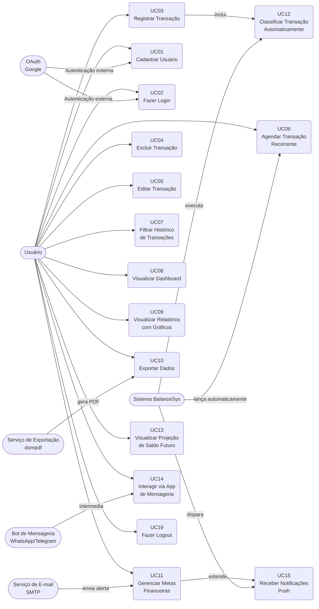

# Diagrama de Casos de Uso — BalanceSys

O diagrama abaixo representa os atores internos e externos do sistema e suas interações com os Casos de Uso.

## Legenda

| Símbolo | Significado |
|---------|------------|
| `-->` | Associação direta entre ator e caso de uso |
| `inclui` | Um UC obrigatoriamente executa outro |
| `estende` | Um UC pode, em certas condições, acionar outro |
| Ator externo | Serviço de terceiros que interage com o sistema |
